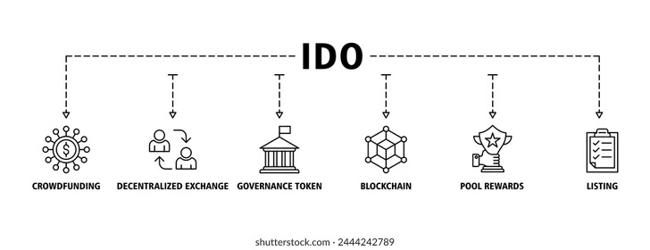

### Readme.md

# LendingPool


## Vision

The **LendingPool** project aims to create a decentralized lending and borrowing platform where users can deposit ERC-20 tokens into various pools, borrow tokens against their deposits, and manage their loans. The platform seeks to provide an efficient, transparent, and secure way for users to earn interest on their deposits and access liquidity when needed.

## Project Features

- **Add Pool**: The contract owner can create new lending pools with specified ERC-20 tokens and interest rates.
- **Deposit**: Users can deposit tokens into a specified lending pool, increasing their balance and the pool's total supply.
- **Withdraw**: Users can withdraw tokens from a lending pool, reducing their balance and the pool's total supply.
- **Borrow**: Users can borrow tokens from a lending pool up to the available amount based on the pool’s total supply and already borrowed amount.
- **Repay**: Users can repay borrowed tokens to the pool.
- **List Pools**: Retrieve a list of all available pools in the contract.
- **Event Logging**: Emitting events to log important state changes and debugging information.

## Future Scope

1. **Interest Calculation**: Implement automatic interest calculation and distribution based on the annual interest rate.
2. **Collateral Management**: Integrate collateral management to ensure borrowed amounts are backed by sufficient deposits.
3. **Admin Dashboard**: Develop a user-friendly dashboard for managing pools and monitoring activity.
4. **User Interface**: Create a web interface for interacting with the LendingPool contract.
5. **Additional Security**: Implement more advanced security features, such as flash loan protection and liquidation mechanisms.

## Project Structure

- **`LendingPool.sol`**: Solidity smart contract containing the logic for managing lending pools, deposits, withdrawals, borrowing, and repayment.
- **`README.md`**: Project documentation, including setup instructions, features, and usage details.
- **`contracts/`**: Directory containing the Solidity smart contract files.
- **`scripts/`**: Directory for deployment and interaction scripts.
- **`tests/`**: Directory for testing scripts and test cases.
- **`.env`**: Environment file containing sensitive data like private keys and API keys (not included in the repository).

## Usage

### Adding a Pool

**Function Signature:**
```solidity
function addPool(address _token, uint256 _interestRate) external onlyOwner
```

- `_token`: Address of the ERC-20 token contract.
- `_interestRate`: Annual interest rate for the pool (as a percentage).

**Example:**
```javascript
await lendingPool.addPool("0xE08C0c643719BbF59494B401f812507206CF23FC", 12);
```

### Depositing

**Function Signature:**
```solidity
function deposit(uint256 _poolId, uint256 _amount) external
```

- `_poolId`: ID of the pool to deposit into.
- `_amount`: Amount of tokens to deposit.

**Example:**
```javascript
await lendingPool.deposit(0, web3.utils.toWei('10', 'ether'));
```

### Withdrawing

**Function Signature:**
```solidity
function withdraw(uint256 _poolId, uint256 _amount) external
```

- `_poolId`: ID of the pool to withdraw from.
- `_amount`: Amount of tokens to withdraw.

**Example:**
```javascript
await lendingPool.withdraw(0, web3.utils.toWei('5', 'ether'));
```

### Borrowing

**Function Signature:**
```solidity
function borrow(uint256 _poolId, uint256 _amount) external
```

- `_poolId`: ID of the pool to borrow from.
- `_amount`: Amount of tokens to borrow.

**Example:**
```javascript
await lendingPool.borrow(0, web3.utils.toWei('2', 'ether'));
```

### Repaying

**Function Signature:**
```solidity
function repay(uint256 _poolId, uint256 _amount) external
```

- `_poolId`: ID of the pool to repay into.
- `_amount`: Amount of tokens to repay.

**Example:**
```javascript
await lendingPool.repay(0, web3.utils.toWei('2', 'ether'));
```

### Listing Pools

**Function Signature:**
```solidity
function listPools() external view returns (uint256[] memory)
```

**Example:**
```javascript
const poolIds = await lendingPool.listPools();
console.log(poolIds);
```

## Developer Details

- **Name**: Raj Maueya
- **Email**: rajmahimaurya@gmail.com
- **GitHub**: github.com/ajju-raj
- **LinkedIn**: www.linkedin.com/in/raj-maurya-271b32237

## Deployment

Chain Name: EduChain Open Campus
Contract Address: 0xce6b0aa74ac169d0b18cbb6891585399f875e6f5


